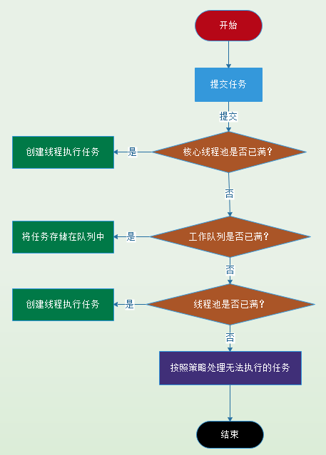

# 线程

***

## 实现线程的三种方式

> 继承 Thread 类创建线程

**步骤**

- 定义继承 Thread 的子类，并重写 run() 方法

- 创建继承 Thread 的子类实例，即创建了线程对象

- 调用 start() 方法启动线程

**示例代码**

- 继承 Thread 类->MyThread.java

```markdown
 
    package com.dao.thead.core;
    
    /**
     * 继承 Thread 类创建线程
     *
     * @author 阿导
     * @version 1.0
     * @fileName com.dao.thead.core.MyThead.java
     * @CopyRright (c) 2018-万物皆导
     * @created 2018-04-11 13:32:00
     */
    public class MyThread extends Thread {
    
        /**
         * 重写 run 方法
         *
         * @author 阿导
         * @time 2018/4/11
         * @CopyRight 万物皆导
         * @param
         * @return void
         */
        @Override
        public void run(){
            System.out.println("这是继承 Thread 类创建线程。");
        }
    }
    
    
```


- 调用

```markdown

    //启动继承 Thread  类的线程
    new MyThread().start();

```


> 实现 Runnable 接口创建线程

**步骤**

- 定义实现 Runnable 的子类，并重写实现 run() 方法

- 创建实现 Runnable 的子类实例，并用这个实例作为 Thread 的 target 来创建 Thread 对象，这个 Thread 对象才是真正的线程对象

- 调用 start() 方法启动线程

**示例代码**


- 实现 Runnable 类->MyRunnable.java

```markdown
 
    package com.dao.thead.core;
    
    /**
     * 实现 Runnable 接口创建线程
     *
     * @author 阿导
     * @version 1.0
     * @fileName com.dao.thead.core.MyRunnable.java
     * @CopyRright (c) 2018-万物皆导
     * @created 2018-04-11 13:32:00
     */
    public class MyRunnable implements Runnable {
    
        /**
         * 实现 run 方法
         *
         * @author 阿导
         * @time 2018/4/11
         * @CopyRight 万物皆导
         * @param
         * @return void
         */
        @Override
        public void run() {
            System.out.println("这里是实现 Runnable 接口创建线程。");
        }
    }

    
```


- 调用

```markdown

    //启动实现 Runnable 接口的线程
    new Thread(new MyRunnable()).start();

```


> 使用 Callable 和 Future 创建线程

###### 和 Runnable 接口不一样，Callable 接口提供了一个 call（）方法作为线程执行体，call() 方法比 run() 方法功能要强大。

**步骤**

- 定义实现 Callable 的子类，并实现 call() 方法

- 使用 FutureTask 类来包装实现 Callable 的子类，其包装的返回值(泛型)应和对应子类保持一致

- 将 FutureTask 对象作为 Thread 的 target 创建线程，并通过 start() 来启用线程

- 然后通过 get() 方法获取返回值，该阶段，线程会进入阻塞状态，直到所有线程结束。

**示例代码**

- 实现 Callable 类->MyCallable.java

```markdown
 
    package com.dao.thead.core;
    
    import java.util.concurrent.Callable;
    
    /**
     * 使用 Callable 和 Future 创建线程
     *
     * @author 阿导
     * @version 1.0
     * @fileName com.dao.thead.core.MyCallable.java
     * @CopyRright (c) 2018-万物皆导
     * @created 2018-04-11 13:33:00
     */
    public class MyCallable implements Callable<String> {
    
        /**
         * 实现 call() 方法
         * @author 阿导
         * @time 2018/4/11
         * @CopyRight 杭州微财科技有限公司
         * @param
         * @return java.lang.String
         */
        @Override
        public String call() throws Exception {
            System.out.println("这是使用 Callable 和 Future 创建线程。");
            return "万物皆导";
        }
    }


    
```


- 调用

```markdown

      //使用 FutureTask 获取实现 Callable 的线程
      FutureTask<String> task=new FutureTask<String>(new MyCallable());
      //将任务放入线程执行，实质上还是以 Callable 对象来创建并启动线程
      new Thread(task,"测试带返回值的线程").start();
      //查看线程返回值，get() 方法会阻塞，直到子线程执行结束才返回
      System.out.println("带回来的结果:"+task.get());

```

> 对比三种线程的实现方式


- 线程只是实现 Runnable 或实现 Callable 接口，还可以继承其他类。
  
- 这种方式下，多个线程可以共享一个 target 对象，非常适合多线程处理同一份资源的情形。
  
- 但是编程稍微复杂，如果需要访问当前线程，必须调用 Thread.currentThread() 方法。
  
- 继承 Thread 类的线程类不能再继承其他父类（Java 单继承决定）。
  
**注：一般推荐采用实现接口的方式来创建多线程**


## 一些案例

案例来自于一些哥们和我分享的面试题，目前我这边听到最多的就是设计死锁和线程安全问题，下面我对这两个问题一一分析，不当之处，欢迎指正，我一贯认为写博客其实就是帮助自己成长的一种形式，也是给自己记录笔记，在各位大佬的指正下，我会成长的更快。

### 死锁问题
如何设置一个死锁程序？可能很多人一下子很蒙圈，若能理清什么是死锁，然后反向考虑，问题便很简单，一般来说产生死锁的原因就是资源申请不下来，线程一直处于阻塞等待状态，那么反向考虑只需要2个线程便能设计一个死锁程序，暂且设定两个线程 A、B ，并设置两个条件必须同时在一个线程拥有这两个条件才能执行结束，否则两个线程就处于阻塞状态，这样便设计出死锁程序了，话不多说，直接撸代码。

```java


/**
 * 死锁程序设计
 *
 * @author 阿导
 * @CopyRight 万物皆导
 * @Created 2019年03月25日 14:22:00
 */
public class DeadThread {
    /**
     *  AB 执行的必要条件
     */
    private static Object conditionAB = new Object();
    /**
     * BA 执行的必要条件
     */
    private static Object conditionBA = new Object();

    /**
     * 主程序
     * @param args
     */
    public static void main(String[] args) {
        // 线程 A
        Thread threadA = new Thread(()->{
         synchronized (conditionAB){
             System.out.println("A 线程开始");


             System.out.println("A 线程即将进入阻塞状态");

             synchronized (conditionBA){
                 System.out.println("A 线程阻塞状态结束");
             }

             System.out.println("A 线程结束");

         }
        });

        // 线程 B
        Thread threadB = new Thread(()->{
            synchronized (conditionBA){
                System.out.println("B 线程开始");

                System.out.println("B 线程即将进入阻塞状态");

                synchronized (conditionAB){
                    System.out.println("B 线程阻塞状态结束");
                }

                System.out.println("B 线程结束");

            }
        });

        threadA.start();
        threadB.start();
    }
}


```


### 线程安全问题

前几天，过去和我共事的一个小哥们说他去面试了蚂蚁金服，他说面试官给他一个线程安全方面的问题，思路不是很清晰，因为阿导面试经验不是很丰富，对那些所谓的面试套路，面试题存储量是很少的，来杭州总共面试两次，都是同一个大佬，也没怎么太刁难我，所以很多面试题目我都表示很慌的，既然哥们有求于我，那怎么也得仗义相助一下，首先蚂蚁金服那位大佬的面试题如下：

```java

学生成绩数据查询、修改、打印功能
【场景描述】
使用多线程方式，实现学生成绩数据查询、修改、打印功能。
线程A：从数据库中获取学生的成绩数据（stu_id, score1, score2, score3），stu_id代表学生ID，score1 - score3是代表三门课的成绩
线程B：会对这三门课的成绩进行修改
线程C：会对这三门课的成绩进行打印输出

【要求】
1.在线程B修改成绩的过程中，线程C不能对成绩进行打印，线程A不能读取数据
2.线程A从数据库读取数据的过程中，线程B不能修改成绩，线程C也不能打印成绩
3.线程C打印成绩的过程中，线程A不能读取数据，线程B不能修改数据。
4.主线程用于检测3个线程的状态，如果线程挂了，则重启线程。

学生成绩服务接口：

/**
 * 查询学生成绩
 * @param stuId 学生ID，由cmd控制台输入
 * @return 学生成绩模型
 **/
public StudentDO StudentService.queryStudent(String stuId);

/**
 * 修改学生成绩
 * @param student 学生模型，由cmd控制台输入
 * @return 修改影响记录数
 **/
public int StudentService.updateStudent(StudentDO student);

/**
 * 打印学生成绩
 * @param student 学生模型
 **/
public void StudentService.printStudent(StudentDO student);


public class StudentManager {
    public static void main(String[] args) {
       // TODO 完成此处的代码

    }
}

```

当哥们发过来面试题的时候，我这边因为在忙项目，并没仔细看题目，我以为是侧重点是线程竞争问题，等我这边事情忙完了，我仔细审题了一遍，发现这应该考虑的是线程安全问题。

其实实现方式有很多种，最为简单的无非就是加个锁，我这边以重入锁为例，大家也可以尝试其他的实现方式，以下是我的代码示例。

```java

package com.dao.example;

import java.util.concurrent.locks.Lock;
import java.util.concurrent.locks.ReentrantLock;

/**
 * 线程安全问题
 *
 * @author 阿导
 * @CopyRight 萬物皆導
 * @Created 2019年03月25日 16:55:00
 */
public class ThreadSafe {

    /**
     * 重入锁锁定当前执行的对象，只是测试，正式环境慎用，防止导致死锁的情况
     */
    private static Lock lock = new ReentrantLock();

    /**
     * 业务实现，只是示例，实际写代码应该单独写一个类去实现接口，建议平时开发注意依赖倒置原则
     */
    private StudentService studentService = new StudentService() {
        @Override
        public StudentDO queryStudent(Long stuId) {
            System.out.println("查询学生信息:" + stuId);
            return new StudentDO();
        }

        @Override
        public int updateStudent(StudentDO student) {
            System.out.println("更新学生信息" + student.getId());

            return 0;
        }

        @Override
        public void printStudent(StudentDO student) {
            System.out.println("打印学生信息" + student.getId());

        }
    };

    /**
     * 打印学生成绩适配器
     */
    private StudentServiceAdapter printAdapter = new PrintAdapter();
    /**
     * 更新学生成绩适配器
     */
    private StudentServiceAdapter updateAdapter = new UpdateAdapter();
    /**
     * 查询学生信息适配器
     */
    private StudentServiceAdapter queryAdapter = new QueryAdapter();

    /**
     * 主方法
     *
     * @param args
     */
    public static void main(String[] args) {
        ThreadSafe main = new ThreadSafe();
        StudentDO studentDO = new StudentDO();
        Long id = 0L;
        studentDO.setId(id);
        // 根据适配器选择不同的操作
        Thread threadA = getThread(main.studentService, studentDO, main.queryAdapter);
        Thread threadB = getThread(main.studentService, studentDO, main.updateAdapter);
        Thread threadC = getThread(main.studentService, studentDO, main.printAdapter);


        // 主线程检测线程状态
        while (true) {
            keepThreadLive(threadA,main.studentService,studentDO,main.queryAdapter);
            keepThreadLive(threadB,main.studentService,studentDO,main.updateAdapter);
            keepThreadLive(threadC,main.studentService,studentDO,main.printAdapter);
        }
    }

    /**
     * 确保线程是活的
     *
     * @author 阿导
     * @time 2019/3/26 9:49
     * @CopyRight 万物皆导
     * @param thread
     * @param studentService
     * @param studentDO
     * @param serviceAdapter
     * @return
     */
    private static void keepThreadLive(Thread thread,StudentService studentService,StudentDO studentDO,StudentServiceAdapter serviceAdapter){
        if (thread == null || !thread.isAlive() || thread.isInterrupted()) {
            (thread = getThread(studentService, studentDO,serviceAdapter)).start();
        }
    }


    /**
     * 业务处理适配接口层
     *
     * @author 阿导
     * @CopyRight 萬物皆導
     * @created 2019/3/25 17:08
     * @Modified_By 阿导 2019/3/25 17:08
     */
    interface StudentServiceAdapter {
        /**
         * 适配处理
         *
         * @param studentService
         * @param studentDO
         * @return
         * @author 阿导
         * @time 2019/3/25 17:10
         * @CopyRight 萬物皆導
         */
        void doAdapter(StudentService studentService, StudentDO studentDO);
    }

    class PrintAdapter implements StudentServiceAdapter {

        /**
         * 适配处理：打印學生成績
         *
         * @param studentService
         * @param studentDO
         * @return
         * @author 阿导
         * @time 2019/3/25 17:10
         * @CopyRight 萬物皆導
         */
        @Override
        public void doAdapter(StudentService studentService, StudentDO studentDO) {
            studentService.printStudent(studentDO);
        }
    }

    class UpdateAdapter implements StudentServiceAdapter {

        /**
         * 适配处理：更新學生信息
         *
         * @param studentService
         * @param studentDO
         * @return
         * @author 阿导
         * @time 2019/3/25 17:10
         * @CopyRight 萬物皆導
         */
        @Override
        public void doAdapter(StudentService studentService, StudentDO studentDO) {
            studentService.updateStudent(studentDO);
        }
    }

    class QueryAdapter implements StudentServiceAdapter {

        /**
         * 适配处理：查詢學生信息
         *
         * @param studentService
         * @param studentDO
         * @return
         * @author 阿导
         * @time 2019/3/25 17:10
         * @CopyRight 萬物皆導
         */
        @Override
        public void doAdapter(StudentService studentService, StudentDO studentDO) {
            studentService.queryStudent(studentDO.getId());
        }
    }


    /**
     * 获取线程
     *
     * @param studentService
     * @param studentDO
     * @param serviceAdapter
     * @return
     * @author 阿导
     * @time 2019/3/25 17:03
     * @CopyRight 萬物皆導
     */
    private static Thread getThread(StudentService studentService, StudentDO studentDO, StudentServiceAdapter serviceAdapter) {
        return new Thread(() -> {
            try {
                lock.lock();
                // 模拟业务处理
                Thread.sleep(50L);
                studentDO.setId(studentDO.getId() + 1L);
                // 根据适配器去选择不同的操作
                serviceAdapter.doAdapter(studentService, studentDO);
            } catch (InterruptedException e) {
                e.printStackTrace();
            } finally {
                lock.unlock();
            }
        }
        );
    }
}


/**
 * 学生操作业务接口层
 *
 * @author 阿导
 * @CopyRight 萬物皆導
 * @created 2019/3/25 16:56
 * @Modified_By 阿导 2019/3/25 16:56
 */

interface StudentService {
    /**
     * 查询学生成绩
     *
     * @param stuId 学生ID，由cmd控制台输入
     * @return 学生成绩模型
     **/

    StudentDO queryStudent(Long stuId);

    /**
     * 修改学生成绩
     *
     * @param student 学生模型，由cmd控制台输入
     * @return 修改影响记录数
     **/

    int updateStudent(StudentDO student);

    /**
     * 打印学生成绩
     *
     * @param student 学生模型
     **/

    void printStudent(StudentDO student);
}

/**
 * 学生实体
 *
 * @author 阿导
 * @CopyRight 萬物皆導
 * @created 2019/3/25 16:56
 * @Modified_By 阿导 2019/3/25 16:56
 */

class StudentDO {
    /**
     *
     */
    private Long id;

    private Integer score1;
    private Integer score2;
    private Integer score3;

    public Long getId() {
        return id;
    }

    public void setId(Long id) {
        this.id = id;
    }

    public Integer getScore1() {
        return score1;
    }

    public void setScore1(Integer score1) {
        this.score1 = score1;
    }

    public Integer getScore2() {
        return score2;
    }

    public void setScore2(Integer score2) {
        this.score2 = score2;
    }

    public Integer getScore3() {
        return score3;
    }

    public void setScore3(Integer score3) {
        this.score3 = score3;
    }
}


```


## 线程池

> 为什么要用线程池？

- 在程序运行过程中，线程资源是稀缺的，为了减少线程创建和销毁，使得线程得以重复利用，所以使用线程池。

- 防止滥用线程，通过线程池，可以有效的控制工作中的线程数量，防止服务器 CPU 或者内存消耗过多导致崩溃，造成重大损失。

> 线程池的构造方法

```markdown

    public ThreadPoolExecutor(int corePoolSize,
                              int maximumPoolSize,
                              long keepAliveTime,
                              TimeUnit unit,
                              BlockingQueue<Runnable> workQueue) {
            this(corePoolSize, maximumPoolSize, keepAliveTime, unit, workQueue,Executors.defaultThreadFactory(), defaultHandler);
    }
        
    public ThreadPoolExecutor(int corePoolSize,
                              int maximumPoolSize,
                              long keepAliveTime,
                              TimeUnit unit,
                              BlockingQueue<Runnable> workQueue,
                              ThreadFactory threadFactory) {
                this(corePoolSize, maximumPoolSize, keepAliveTime, unit, workQueue,threadFactory, defaultHandler);
    }
    
    public ThreadPoolExecutor(int corePoolSize,
                              int maximumPoolSize,
                              long keepAliveTime,
                              TimeUnit unit,
                              BlockingQueue<Runnable> workQueue,
                              RejectedExecutionHandler handler) {
            this(corePoolSize, maximumPoolSize, keepAliveTime, unit, workQueue,Executors.defaultThreadFactory(), handler);
    }
    
    public ThreadPoolExecutor(int corePoolSize,
                              int maximumPoolSize,
                              long keepAliveTime,
                              TimeUnit unit,
                              BlockingQueue<Runnable> workQueue,
                              ThreadFactory threadFactory,
                              RejectedExecutionHandler handler) {
         if (corePoolSize < 0 ||
             maximumPoolSize <= 0 ||
             maximumPoolSize < corePoolSize ||
             keepAliveTime < 0)
             throw new IllegalArgumentException();
         if (workQueue == null || threadFactory == null || handler == null)
             throw new NullPointerException();
         this.corePoolSize = corePoolSize;
         this.maximumPoolSize = maximumPoolSize;
         this.workQueue = workQueue;
         this.keepAliveTime = unit.toNanos(keepAliveTime);
         this.threadFactory = threadFactory;
         this.handler = handler;
    }
    
    
```

##### 观察其构造方法，发现最终调的是参数最多的那个构造方法，只是根据经验，一些参数给了默认值，减少开发者传入参数过多带来的困扰，下面讲述一下各个参数代表的含义。

- corePoolSize：线程池核心线程数量

###### 核心池的大小，这个参数跟后面讲述的线程池的实现原理有非常大的关系。在创建了线程池后，默认情况下，线程池中并没有任何线程，而是等待有任务到来才创建线程去执行任务，除非调用了 prestartAllCoreThreads()或者 prestartCoreThread() 方法，从这2个方法的名字就可以看出，是预创建线程的意思，即在没有任务到来之前就创建corePoolSize 个线程或者一个线程。默认情况下，在创建了线程池后，线程池中的线程数为0，当有任务来之后，就会创建一个线程去执行任务，当线程池中的线程数目达到 corePoolSize 后，就会把到达的任务放到缓存队列当中


- maximumPoolSize：线程池最大线程数量

###### 线程池最大线程数，这个参数也是一个非常重要的参数，它表示在线程池中最多能创建多少个线程

- keepAliveTime：当活跃线程数大于核心线程数时，空闲的多余线程最大存活时间

###### 表示线程没有任务执行时最多保持多久时间会终止。默认情况下，只有当线程池中的线程数大于 corePoolSize 时，keepAliveTime 才会起作用，直到线程池中的线程数不大于 corePoolSize，即当线程池中的线程数大于 corePoolSize 时，如果一个线程空闲的时间达到 keepAliveTime，则会终止，直到线程池中的线程数不超过 corePoolSize。但是如果调用了 allowCoreThreadTimeOut(boolean)方法，在线程池中的线程数不大于 corePoolSize 时，keepAliveTime 参数也会起作用，直到线程池中的线程数为0

- unit：存活时间的单位

###### 参数 keepAliveTime 的时间单位，有7种取值，在 TimeUnit 类中有7种静态属性：

```markdown

           TimeUnit.DAYS;               //天
           TimeUnit.HOURS;             //小时
           TimeUnit.MINUTES;           //分钟
           TimeUnit.SECONDS;           //秒
           TimeUnit.MILLISECONDS;      //毫秒
           TimeUnit.MICROSECONDS;      //微妙
           TimeUnit.NANOSECONDS;       //纳秒

```

- workQueue：存放任务的队列

###### 一个阻塞队列，用来存储等待执行的任务，这个参数的选择也很重要，会对线程池的运行过程产生重大影响，一般来说，这里的阻塞队列有以下几种选择：

###### (1) <label style="color=#FF0923">ArrayBlockingQueue</label>
###### (2) <label style="color=#FF0923">LinkedBlockingQueue</label>
###### (3) <label style="color=#FF0923">SynchronousQueue</label>

###### ArrayBlockingQueue 和 PriorityBlockingQueue 使用较少，一般使用 LinkedBlockingQueue 和 Synchronous。线程池的排队策略与 BlockingQueue 有关。


- threadFactory：线程工厂，用来创建线程

- handler：超出线程范围和队列容量的任务的处理程序

###### 表示当拒绝处理任务时的策略，有以下四种取值：

###### (1) <label style="color=#FF0923">ThreadPoolExecutor.AbortPolicy</label>:丢弃任务并抛出RejectedExecutionException异常

###### (2) <label style="color=#FF0923">ThreadPoolExecutor.DiscardPolicy</label>：也是丢弃任务，但是不抛出异常

###### (3) <label style="color=#FF0923">ThreadPoolExecutor.DiscardOldestPolicy</label>：丢弃队列最前面的任务，然后重新尝试执行任务（重复此过程）

###### (4) <label style="color=#FF0923">ThreadPoolExecutor.CallerRunsPolicy</label>：由调用线程处理该任务


> 线程实现原理

- 首先用户先提交线程任务

- 首先判断线程池核心线程是否都在执行任务，若没有（核心线程空闲或者还有核心线程没有被创建）则创建新的线程来执行任务，若核心线程都在执行任务，进入下一流程

- 然后判断线程池队列是否已经满了，若没有，则将新提交的任务放入线程队列中，若已满；进入下一流程

- 判断线程是否都处于工作状态，若没有，则新创建一个线程来执行任务，若已经满了，则交给饱和策略来处理这个任务



